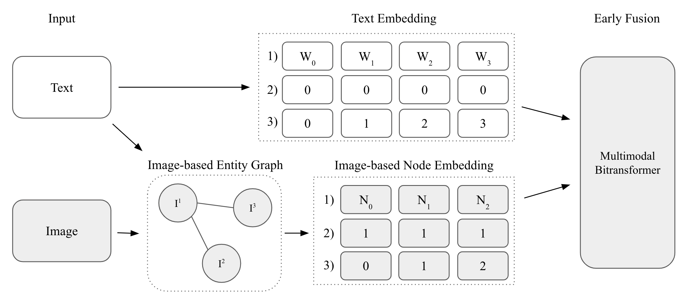

# MM-GATBT: Enriching Multimodal Representation Using Graph Attention Network 




- This repository contains implementation of MM-GATBT available on NACCL 2022 SRW. 
- MM-GATBT is built upon [MMBT](https://github.com/facebookresearch/mmbt)


## Installation 

> Clone the repository into your local directory 

```
git clone git@github.com:sbseo/mm-gatbt.git
```

```
cd mm-gatbt
```


##  Requirements

1. Software requirement

``` 
pip install -r requirements.txt
```

2. Hardware requirement (Optional)

   - GPU: Nvidia 3090 (vRAM: 24 gb)
   - Driver Version: 470.103.01

 

## MM-IMDb Dataset

1. Download dataset (8.1G) (Arevalo et al., 2017)
```
    wget -O mmimdb.tar.gz https://archive.org/download/mmimdb/mmimdb.tar.gz
```

2. Decompress the file after download.
```
    tar -xf mmimdb.tar.gz
```

3. Preprocess dataset (Kiela, 2019)
```
cd scripts
```
```
python3 format_mmimdb_dataset.py ../
```
4. Construct graph (This may take awhile)
```
python3 format_mmimdb_as_graph.py ../ medium
```
```
cd ..
```

## Train model

Pre-saved EfficientNet embedding is available to reduce image loading time. If you prefer to load EfficientNet from scratch, simply remove `load_imgembed`  argument.

   - Pre-saved EfficientNet embedding: [eff_embedding.pt](https://drive.google.com/file/d/1wHsqBQfeXqGf_xEQRO7GIr7aJlkFY3bk/view?usp=sharing)

```
gdown 1wHsqBQfeXqGf_xEQRO7GIr7aJlkFY3bk
```

1. Train image-based GAT

> Training GAT will save its best model `eff_gat_256.pth` and its prediction results under dir `./eff_gat_256/`

    python3 mmgatbt/gnn_train.py --img_enc eff --model gat --name eff_gat_256 --load_imgembed ./eff_embedding.pt


2. Train MM-GATBT

> Training MM-GATBT will save its prediction results under dir `./mmgatbt_eff256/`

    python3 mmgatbt/train.py --img_enc eff --model mmgatbt --name mmgatbt_eff256 --gnn_load ./eff_gat_256/eff_gat_256.pth --batch_sz 12 --load_imgembed ./eff_embedding.pt


## Pre-trained Model

Pre-trained models for both MM-GATBT (main model) and image-based GAT (submodel). 

- Image-based GAT: [eff_gat_256.pth](https://drive.google.com/file/d/1S4ltCiWou75qKYmXnRmxU-2py0Oz6Czb/view?usp=sharing)
- MM_GATBT: [mmgatbt_eff256.zip](https://drive.google.com/file/d/12O9-kOBxk-Ggw85Vo9M5SDFcTpDPlMcE/view?usp=sharing)

```
gdown 1S4ltCiWou75qKYmXnRmxU-2py0Oz6Czb
```
```
gdown 12O9-kOBxk-Ggw85Vo9M5SDFcTpDPlMcE
unzip mmgatbt_eff256.zip
```

## Validation 

Set `max_epochs` to `0` for validation

> Predicted results can be also found under `./mmgatbt_eff256/`

    python3 mmgatbt/train.py --img_enc eff --model mmgatbt --name mmgatbt_eff256 --gnn_load ./eff_gat_256.pth --batch_sz 12 --max_epochs 0 --load_imgembed ./eff_embedding.pt


## Citation

